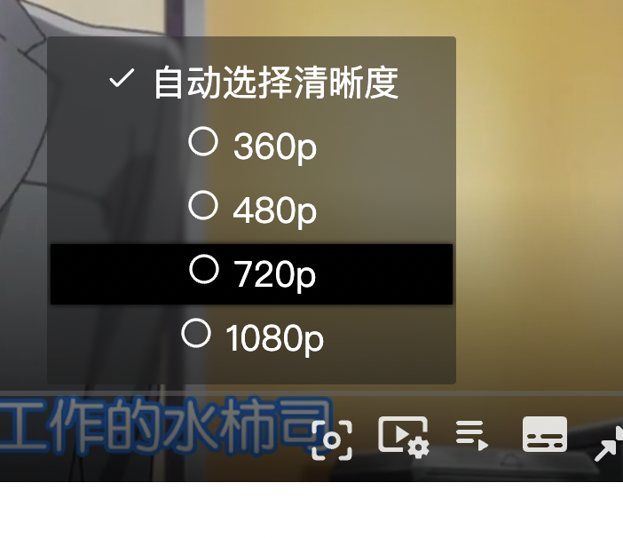

## Using HLS plugin

**If you want to stream hls video, you need to embed hls.js first.**

**[hls.js](https://github.com/video-dev/hls.js)**

DEMO
```html
<script src="https://cdn.jsdelivr.net/npm/hls.js@1"></script>
<script src="https://cdn.jsdelivr.net/npm/@wenzi7777/mplayer@latest/dist/mplayer.bundle.min.js"></script>
<div id={'mplayer'}></div>
<script>
    let options = {
        videos: [
            {
                title: 'video title',
                src: 'video src.m3u8'
            }
        ]
    }
    const mplayer = new MPlayer(document.querySelector('#mplayer'), options)
</script>
```

**if your manifests file provided more than one resolution, MPlayer will read resolutions info automatically then make users can select it manually.**
