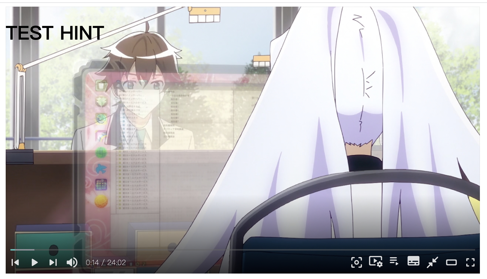
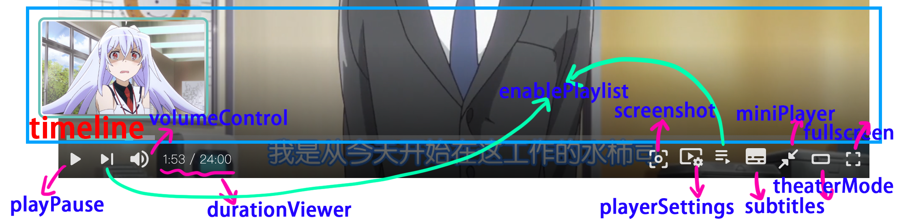
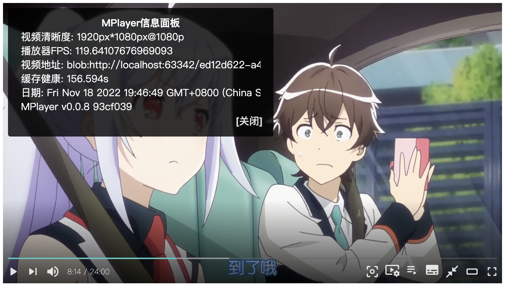
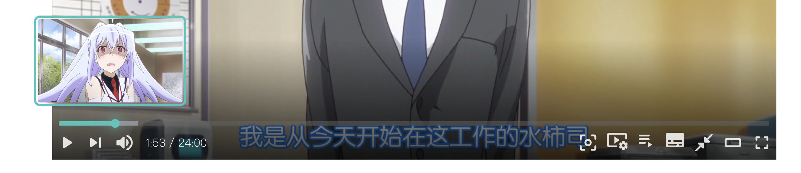
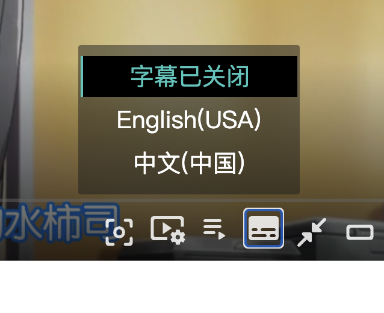

## Installation

### Using NPM

```bash
npm i @wenzi7777/mplayer@latest
```

### Or CDN

```html
<script src='https://cdn.jsdelivr.net/npm/@wenzi7777/mplayer@latest/dist/mplayer.bundle.min.js'></script>
```

## Initializing MPlayer
- You can create a MPlayer instance using MPlayer class when MPlayer being hooked in window object.
- MPlayer constructor requires 2 params, the first one is **the element that MPlayer instance will be injected in**, the second one is a **config object**.

MPlayer constructor params：

|ORDER|PARAMS|DESC|REQUIRED|
|:--:|:--:|:--:|:--:|
|0|element|the element that MPlayer instance will be injected in|YES|
|1|options|player config|YES|

**Let's make a simplest MPlayer!**
- Provide a container
```html
<div id='mplayer'></div>
```
- Require MPlayer
**Using modules manager**
```javascript
import MPlayer from '@wenzi7777/mplayer';
const mplayer = new MPlayer(element, options);
```

**Or CDN**
```html
<script src='https://cdn.jsdelivr.net/npm/@wenzi7777/mplayer@latest/dist/mplayer.bundle.min.js'></script>
```

- Create MPlayer instance
```html
<script>
    let options = {
        videos: [
            {
                title: 'video title',
                src: 'video src'
            }
        ]
    }
    const mplayer = new MPlayer(document.querySelector('#mplayer'), options)
</script>
```

## MPlayer config
You can customize your own MPlayer instance by passing in MPlayer config object.
|NAME|DEFAULT VALUE|OPTIONAL VALUE|TYPE|DESC|REQUIRED|
|:--:|:--:|:--:|:--:|:--:|:--:|
|lang|en_US|zh_CN, zh_TW, en_US|String|MPlayer language|NO|
|playerMode|normal|normal, live|String|MPLayer mode|NO|
|autoplay|false|true, false|Boolean|autoplay video when MPlayer loading completely.|NO|
|hints|false|view more in 'Params' page|Object|Hints feature configs|NO|
|spotlight|false|view more in 'Params' page|Object|Spotlight feature configs|NO|
|theme|#39c5bb|any Hex color|String|MPlayer theme color, only Hex color is ok.|NO|
|tools|all available tools are enabled by default.|view more in 'Params' page|Array|MPlayer controls config|NO|
|hotkey|true|true, false|Boolean|enable hotkey|NO|
|preload|true|true, false|Boolean|preload video|NO|
|volume|1|any value between 1 and 0|Number|default volume|NO|
|playbackRares|.25, .5, .75, 1, 1.25, 1.5, 1.75, 2|view more in 'Params' page|Array|playback rates can be choose|NO|
|index|0|any value|Number|the index of a video will be play by default|NO|
|infoPanel|all available infos are enabled by default|view more in 'Params' page|Array|infos shown on MPlayer info panel|NO|
|contextMenu|2 options, one is the link of this site, the other is toggle info panel|view more in 'Params' page|Array|MPlayer context menu|NO|
|videos|no default value|view more in 'Params' page|Array|video list|YES|

## Params

### lang
MPlayer's language, MPlayer support ***Simplify Chinese***, ***Traditional Chinese*** and ***English(U.S.A.)***
You can open **[translation.js](https://github.com/wenzi7777/MPlayer/blob/main/src/js/translation.js)**to add your own translation or see current language support information.
|VALUE|DESC|
|:--:|:--:|
|zh_CN|Simplify Chinese|
|zh_TW|Traditional Chinese|
|en_US|English(U.S.A.)|

### playerMode
MPlayer mode, only ***normal*** mode is supported for now.
|VALUE|DESC|
|:--:|:--:|
|normal|normal player|
|live|live player (not support yet)|

### autoplay
autoplay

**ATTENTION: some browsers will block autoplay.**
|VALUE|DESC|
|:--:|:--:|
|true|turn autoplay on|
|false|turn autoplay off|

### hints
Hints config, hints are disabled by default.
If hints are enabled, you can display infos on player by create hints config object.

**DEFAULT VALUE**
```json
{
    "enabled": false
}
```

**DEMO**
```javascript
hints = {
  "enabled": true, // enable hints
  "elements": [ // elements list
      {
          "start": 10, // start time (seconds)
            "end": 20, // end time (seconds)
            "html": `<h1>TEST HINT</h1>` // html contents will be display
      }
  ]
}
```



### spotlight
Spotlight config, spotlight is disabled by default.
Spotlight is a feature which is similar to Youtube Ambient Mode.
You can enable spotlight by provide a correct config object.

**默认值**
```json
{
    "enabled": false,
    "backgroundColor": "#FFFFFF"
}
```

**使用示例**
```javascript
spotlight = {
  "enabled": true, // enable it
  "backgroundColor": "#FFFFFF" // your main background color of your website, only Hex color is supported.
}
```


### theme
theme color

**Change theme color by editing this config, only Hex color is supported such as (#39c5bb)**

### tools
MPlayer controls config.

**DEFAULT VALUE**
```javascript
['timeline', 'playPause', 'volumeControl', 'durationViewer', 'screenshot', 'playerSettings', 'enablePlaylist', 'subtitles', 'miniPlayer', 'theaterMode', 'fullscreen']
```

**DEMO**
```javascript
['timeline', 'playPause', 'durationViewer','fullscreen']
// only timeline, playPause, durationViewer and fullscreen are enabled.
```

|COMPONENTS NAME|DESC|
|:--:|:--:|
|timeline|time line.|
|playPause|play or pause|
|volumeControl|volume control including the range input.|
|durationViewer|duration|
|screenshot|screenshot|
|playerSettings|player settings|
|enablePlaylist|play next, play previous and playlist|
|subtitles|subtitles control|
|miniPlayer|picture in picture mode|
|theaterMode|theater mode|
|fullscreen|fullscreen|

**COMPONENTS IN DEMO**


### hotkey
hot key

|KEY|DESC|
|:--:|:--:|
|space/k|play or pause|
|f|enter or leave fullscreen|
|t|enter or leave theater mode|
|i|enter or leave picture in picture mode|
|m|mute or unmute|
|arrow left/j|skip -5 seconds|
|arrow right/l|skip 5 seconds|

### preload
preload

### volume
default volume of MPlayer

### playbackRates
values can be chosen

**DEFAULT VALUE**
```javascript
[.25, .5, .75, 1, 1.25, 1.5, 1.75, 2]
```
max is 16, min is 0.

### index
the index of a video in videos property that will be play first.

**DEFAULT VALUE**
```javascript
0
```
If your videos in video property is more than one, you can define this value to make MPlayer first play the video you choose.

### infoPanel
MPlayer info panel config.

**DEFAULT VALUE**
```javascript
['basicVideoInfo', 'playerFPS', 'videoURL', 'connectionStatus', 'date', 'playerInfo']
```
|VALUE|DESC|
|:--:|:--:|
|basicVideoInfo|basic video info.|
|playerFPS|player FPS|
|videoURL|video url|
|connectionStatus|buffer health|
|date|date|
|playerInfo|MPlayer info.|



### contextMenu
MPlayer context menu, you can define your own options.

**DEFAULT VALUE**
```javascript
        [
            { // link to this site
                title: 'MPlayer',
                targetFunction: 'openLink',
                params: `https://mplayer.1205.moe/`
            },
            { // toggle info panel
                title: 'PlayerCN Info',
                targetFunction: 'toggleInfoPanel'
            }
        ]
```

**PARAMS DEFINITION**
If you want to add your own options, please follow this template.

TEMPLATE
```jsonc
{
  "title": "title", // title
  "targetFunction": "function", // the function will be call when this option being clicked
  "params": "test, test" // the params of target function
}
```

|VALUE|DESC|REQUIRED|
|:--:|:--:|:--:|
|title|title|YES|
|targetFunction|target function, view more information in 'API' page|NO|
|params|the params of target function, view more information in 'API' page|NO|

### videos

**this property is REQUIRED**

Basic
```javascript
[
    {
        title: 'video title', // video title is required
        src: 'video url' // video url is required
    }
]
```

is you want to use **preview image**, you need to provide **preview images in order**
```javascript
[
    {
        title: 'video title', // video title is required
        src: 'video url', // video url is required
        images: ['preview01.png', 'preview02.png'] // provide preview images here.
    }
]
```



**MPlayer support webvtt subtitles**
If you want to use webvtt subtitles, you need to provide **tracks** property.
```javascript
[
    {
        title: 'video title', // video title is required
        src: 'video url', // video url is required
        images: ['preview01.png', 'preview02.png'], // provide preview images here.
        tracks: [
                    {
                        srclang: 'en', // language
                        src: './en_US.vtt', // subtitle src
                        label: "English(USA)",  // label
                        kind: "captions" // use captions if you don't know what it is.
                    }
                    ]
    }
]
```
If more than one subtitles are provided, users can switch subtitles.
```javascript
[
    {
        title: 'video title', // video title is required
        src: 'video url', // video url is required
        images: ['preview01.png', 'preview02.png'], // provide preview images here.
        tracks: [
                    {
                        srclang: 'en', // language
                        src: './en_US.vtt', // subtitle src
                        label: "English(USA)",  // label
                        kind: "captions" // use captions if you don't know what it is.
                    },
                    {
                        srclang: 'zh',
                        src: './zh_CN.vtt',
                        label: "中文(中国)",
                        kind: "captions"
                    }
                    ]
    }
]
```
